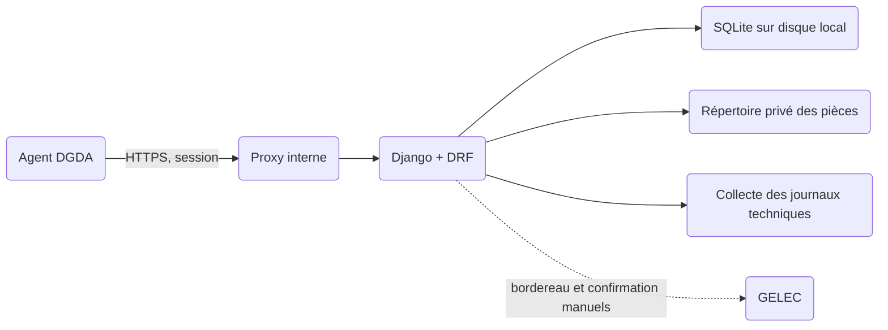

# Procezo — architecture backend du pilote V1

<!-- architecture-section: executive-verdict -->
## Executive Verdict

- **Recommandation :** un monolithe modulaire Django + Django REST Framework (DRF), avec **SQLite pour la petite V1**, un répertoire privé pour les pièces, une API interne `/api/v1` et un journal d'audit métier distinct des journaux techniques. PostgreSQL reste une migration préparée, déclenchée par la charge ou les contraintes d'exploitation observées.
- **Pourquoi :** les renseignements, dossiers, actes, réponses, décisions et statistiques partagent les mêmes droits et transactions. Une instance applicative sur un seul hôte et des écritures modestes permettent de commencer sans serveur de base séparé.
- **Risque principal :** un accès indu à l'identité d'une source ou à une pièce par une liste, un téléchargement, un export ou une statistique.
- **À décider maintenant avec la DGDA, avant données réelles :** pouvoirs et matrice d'habilitation, modèles et circuit des actes, frontière des PV et preuve GELEC, hébergement, conservation et objectifs de reprise.
- **Peut attendre :** PostgreSQL, intégration automatisée, moteur de recherche spécialisé, cache distribué et séparation en services.
- **Confiance :** élevée sur le découpage technique du pilote ; moyenne sur les parcours ; faible sur les règles officielles et la topologie d'hébergement, encore non validées.

**Statut :** architecture proposée le 25 septembre 2026. Elle permet un prototype avec données fictives. Elle ne vaut pas autorisation d'utiliser des données réelles ou d'émettre un acte officiel.

<!-- architecture-section: project-frame -->
## Cadre et périmètre

Le pilote couvre renseignement indépendant ou lié à plusieurs dossiers, affectation et enquête, mission facultative, demandes de communication, feuilles d'observation, réponses et défenses successives, documents et preuves, décisions humaines, relais manuel GELEC, tableaux de bord vérifiables. Le contentieux détaillé, le calcul/recouvrement, le portail des tiers et les synchronisations GELEC/SYDONIA sont exclus.

Les acteurs sont l'enquêteur, le responsable habilité, le gestionnaire courrier éventuel, le lecteur de pilotage, l'administrateur technique et le contrôleur d'audit. Les tiers n'ont pas de compte V1. Les actes peuvent être préparés par formulaire et PDF ou par import du document de l'agent ; les deux chemins rejoignent le même circuit de validation et de suivi.

<!-- architecture-section: evidence-and-assumptions -->
## Preuves, hypothèses et inconnues

| Élément | Statut et source | Confiance / impact | Validation |
|---|---|---|---|
| Quatre besoins V1, parcours et invariants documentaires | Exigence du [PRD](PRD_PROCEZO_V1.md), FR-01 à FR-19 et AC-01 à AC-19 | Haute / fort | Rejeu JOURNEY-01 à 03 |
| Enquête avant contentieux, relais GELEC, traçabilité | [Note de cadrage](Note_de_cadrage_Procezo_DGDA.pdf), p. 1 à 6 | Haute sur le texte, faible sur son approbation / fort | Validation DGDA |
| Une unité pilote, usage interne interactif, faible concurrence en écriture, un seul hôte applicatif | Hypothèse indispensable à SQLite, non mesurée | Moyenne / fort | Inventaire des agents, pièces, tailles, trafic et test de concurrence |
| Application web et API de même origine | Hypothèse pour les sessions et CSRF | Moyenne / moyen | Contrat frontend et hébergement |
| Fournisseur d'identité, MFA et réseau disponibles | Inconnu | Faible / fort | DSI DGDA |
| Règles officielles, données réelles, résidence, conservation, RPO/RTO | Inconnu, PRD DEC-02 à 05 | Faible / critique | Décisions DGDA et exploitation |

Les seuils NFR ci-dessous sont des **cibles provisoires** issues du PRD ou des propositions de validation, jamais des performances déjà mesurées.

<!-- architecture-section: critical-flows -->
## Parcours critiques et frontières de confiance

1. **Renseignement et diffusion :** session d'agent → contrôle rôle, unité, affectation et classification → création du renseignement, éventuellement sans cible → identité de source dans un espace de données réservé → diffusion par destinataire → accusé et retour par destinataire. Un renseignement peut demeurer sans dossier ; aucune diffusion externe automatique.
2. **Demande et réponse :** enquêteur autorisé → dossier visible → brouillon avec liste d'éléments attendus → PDF proposé ou import contrôlé → validation par délégataire → enregistrement distinct de la signature, de l'émission et de la preuve d'envoi → réponses et annexes successives → appréciation par élément. Le fichier reçu ne remplace jamais la version envoyée ; absence de réponse et infraction ne sont pas liées automatiquement.
3. **Feuille, décision et GELEC :** mission éventuelle ou autre origine autorisée → observations numérotées et pièces → défenses liées à une ou plusieurs observations → appréciation motivée → proposition de classement ou relais → validation humaine → transmission GELEC manuelle → référence et confirmation explicite. Une transmission incertaine reste `transmise`, sans confirmation implicite.
4. **Statistique :** lecteur habilité → filtre période/unité validé côté serveur → périmètre d'objets visibles calculé par la politique → agrégat dédupliqué sur ce même périmètre → liste exacte des éléments comptés. Une valeur ne doit jamais compter pour ce lecteur un objet hors droit ni révéler une source protégée par détail ou export.

La frontière de confiance principale est l'API : client, noms de fichiers, PDF importés, filtres, identifiants d'objet et dates de fait sont non fiables. GELEC et SYDONIA ne sont pas des dépendances réseau du pilote.

<!-- architecture-section: quality-scenarios -->
## Scénarios de qualité

| ID | Stimulus | Réponse et seuil | Validation |
|---|---|---|---|
| NFR-01 | Recherche d'un dossier autorisé sur le réseau pilote | Cible PRD : p95 recherche ≤ 3 s, ouverture ≤ 5 s | Mesure avec volume et réseau représentatifs ; requêtes SQL observées |
| NFR-02 | Import ou PDF interrompu | Brouillon et fichiers acceptés retrouvables ; état `en_cours`, `échoué` ou `prêt` explicite ; aucune émission implicite | Coupure pendant dépôt, scan et génération, puis reprise |
| NFR-03 | Lien direct, recherche, liste, aperçu, téléchargement, export ou agrégat non autorisé | Aucun contenu ni existence de source protégée révélés | Matrice de refus par rôle, unité, dossier et classification |
| NFR-05 | Restauration après panne | RPO/RTO à fixer par DGDA ; restaurer ensemble base, objets et audit | Exercice de restauration avant données réelles |
| NFR-06 | Deux agents modifient un brouillon | Le second reçoit `409 conflit` et la version courante, sans écrasement | Test concurrent |
| SEC-01 | Journal ou collecteur indisponible | Action sensible bloquée si l'audit obligatoire ne peut être écrit ; incident technique signalé | Panne simulée et alerte |
| SEC-02 | Pièce malveillante ou non analysable | Pièce en quarantaine, inaccessible aux lecteurs ; reprise ou rejet tracé | Corpus de fichiers invalides et panne scanner |

<!-- architecture-section: architecture -->
## Architecture et propriété des modules

Les applications Django sont des frontières fonctionnelles. Les vues DRF traduisent HTTP ; les services d'application orchestrent les transitions et transactions ; les modèles portent les contraintes de persistance. Une vue ne modifie pas directement plusieurs domaines. Les dépendances passent par des services explicites, jamais par des signaux Django pour les décisions métier ou l'audit obligatoire.

| Application | Responsabilité et données détenues | Dépendances autorisées / échec |
|---|---|---|
| `identity` | Comptes, unités, délégations, habilitations, révocations | Politique centrale ; refus si identité ou droit indéterminé |
| `intelligence` | Renseignements, provenance, source protégée, diffusions et retours | `identity`, `documents`, `audit` ; une diffusion non confirmée reste en attente |
| `cases` | Dossiers, affectations, participants, prochaine action, chronologie métier | `identity`, `audit` ; conflit de version explicite |
| `requests` | Demandes, éléments attendus, réponses, analyses | `cases`, `documents`, `audit` ; aucune émission sur PDF ou preuve manquante |
| `inspections` | Missions, feuilles, observations, défenses | `cases`, `documents`, `audit` ; mission facultative selon règle approuvée |
| `decisions` | Propositions, validations, classements et transferts GELEC | `cases`, `audit` ; aucune suite automatique |
| `documents` | Métadonnées, versions, liens, empreintes, quarantaine et PDF | Stockage privé ; fichier indisponible signalé, jamais remplacé silencieusement |
| `reporting` | Requêtes de comptage et définitions versionnées | Lecture contrôlée des domaines ; indicateur non approuvé masqué |
| `audit` | Événements métier immuables et accès sensibles | Écriture atomique pour mutations ; échec bloquant selon politique |
| `platform` | Erreurs API, corrélation, configuration, tâches techniques | Pas de droit métier implicite |

`identity` fournit une fonction unique de décision `can(actor, action, resource, context)` utilisée par lecture, écriture, fichier, export et reporting. Les domaines fournissent les relations à la ressource ; la politique ne dépend pas des vues HTTP. Aucun module n'accède directement à la table privée d'identité de source, sauf `intelligence` par méthode dédiée.

<!-- architecture-section: data-and-contracts -->
## Données, transactions et contrats

### Modèle relationnel initial

| Agrégat / tables principales | Relations et invariants |
|---|---|
| `User`, `Unit`, `Membership`, `Delegation` | Délégation datée, action et périmètre explicites ; révocation immédiatement prise en compte |
| `Intelligence`, `ProtectedSource`, `IntelligenceDissemination`, `DisseminationReturn` | Source séparée du résumé ; une diffusion et ses retours par bureau ; aucune cible requise |
| `Case`, `CaseAssignment`, `CaseIntelligence`, `CaseAction` | Lien renseignement↔dossier plusieurs à plusieurs ; affectations historisées ; prochaine action distincte du statut |
| `CommunicationRequest`, `RequestedItem`, `RequestResponse`, `ResponseItemAssessment` | Plusieurs demandes par dossier, plusieurs réponses par demande ; réception, complétude et appréciation séparées |
| `InspectionMission`, `ObservationSheet`, `Observation`, `Defense`, `DefenseObservation`, `ObservationAssessment` | Mission facultative ; défense↔observation plusieurs à plusieurs ; observations numérotées dans une feuille |
| `Decision`, `GelecTransfer` | Proposition, validateur, motif, transmission et confirmation distincts ; classement et transfert après validation |
| `Document`, `DocumentVersion`, `DocumentLink`, `FileOperation` | Métadonnées en base ; octets dans répertoire privé ; lien à l'étape métier ; version émise et original reçu non modifiables ; état des opérations de fichier |
| `AuditEvent` | Acteur, action, ressource, résultat, temps serveur, identifiant de requête, motif et changements minimaux ; écriture seule |

Clés techniques UUID, références métier lisibles uniques selon le périmètre DGDA, clés étrangères et contraintes d'unicité. Dates de fait saisies, dates de réception constatées et horodatages serveur en UTC sont distincts ; le fuseau d'affichage/reporting sera approuvé. Aucun `CASCADE DELETE` sur acte émis, réponse, décision, transfert ou audit. Les corrections créent version ou événement de rectification avec motif. Les statuts et catégories sont énumérés/versionnés seulement après validation métier ; une échéance dépassée est calculée, pas un état.

### Cohérence

- Dans un bloc `transaction.atomic()` **court**, les services revérifient habilitation et état, puis font une mise à jour conditionnelle (`WHERE id = ... AND version = ... AND statut = ...`). Une seule mise à jour réussie ; les autres reçoivent `409 conflit`. La mutation et son `AuditEvent` sont commis ensemble. Cela couvre brouillons, validation, émission et transfert. `select_for_update()` n'est jamais utilisé comme garantie sous SQLite : il n'y verrouille aucune ligne. Les contraintes `UNIQUE`, clés étrangères et tests de concurrence complètent cette règle.
- Le fichier est d'abord reçu dans une zone privée de quarantaine, limité en taille, type et nombre, puis son empreinte SHA-256 et son analyse sont enregistrées. Le scan est synchrone et borné **hors de la transaction de base** ; si le scanner est indisponible ou dépasse sa limite, la pièce reste en quarantaine. Un document ne devient `accepté` qu'après vérification et rattachement transactionnel. Une référence à un objet manquant ou une opération interrompue reste visible comme incident à résoudre ; un nettoyage borné supprime les objets orphelins après contrôle.
- La génération PDF est synchrone, bornée et isolée des ressources réseau ; son état est gardé dans `FileOperation`. Une interruption laisse le brouillon intact et permet une reprise avec la même clé d'idempotence, sans dupliquer `DocumentVersion`. Si le scan ou la génération dépasse les limites acceptées en pilote, migrer d'abord vers PostgreSQL puis introduire un travailleur.
- Pour l'émission et le transfert, une clé d'idempotence liée à l'acteur, l'action et la ressource évite les doublons après perte de réponse HTTP. Une émission réessayée retourne le résultat initial ; une confirmation GELEC n'est jamais déduite d'un simple réessai.

SQLite impose de courtes transactions, un disque **local** et un seul hôte applicatif. Le mode WAL peut laisser lire pendant une écriture, mais il ne permet qu'un seul écrivain à la fois ; il ne convient pas à un répertoire réseau partagé. Une erreur `database is locked` est signalée et mesurée, sans réessai aveugle d'une validation ou émission. Ne pas activer `ATOMIC_REQUESTS` pour englober les uploads ou PDF. La recherche insensible à la casse, les contraintes, types et migrations sont testés sur SQLite puis PostgreSQL avant bascule.

### API DRF interne

`/api/v1/` expose des ressources et actions explicites : `renseignements`, `diffusions`, `dossiers`, `affectations`, `demandes`, `reponses`, `missions`, `feuilles`, `defenses`, `decisions`, `transferts-gelec`, `documents`, `statistiques`. Les transitions sont des `POST` d'action (`/demandes/{id}/soumettre`, `/decisions/{id}/valider`, `/transferts-gelec/{id}/confirmer-reception`) avec corps validé et préconditions ; les brouillons utilisent `PATCH` avec `If-Match` ou champ de version. Les identifiants UUID ne constituent jamais une autorisation.

La liste est paginée, triée sur champs autorisés et filtrée dans `get_queryset()` avant sérialisation ; les serializers utilisent une liste blanche de champs en lecture et en écriture. `get_object()` vérifie aussi la permission d'objet ; `create` vérifie le parent et l'affectation. L'API renvoie `404` pour une ressource non visible, `403` pour une action interdite sur une ressource visible, `409` pour conflit, `400` pour entrée invalide, et `503` pour dépendance indisponible. Réponse d'erreur : `code`, `message` sans secret, `request_id`, erreurs de champs ; pas de trace d'exception au client. Une spécification OpenAPI versionnée et des tests de contrat accompagnent l'API. Changements incompatibles sous `/api/v2`; migrations de base de type ajout → reprise → retrait après période de coexistence.

Les téléchargements passent par un endpoint qui revérifie le droit au moment de chaque demande et force `Content-Disposition: attachment` avec type sûr. Aucun lien public durable, aucune pièce directement servie depuis `/media/`, aucun nom de fichier client utilisé comme chemin. Les exports, si approuvés, sont bornés, filtrés par la politique et journalisés ; les identités de sources en sont exclues par défaut.

<!-- architecture-section: trust-and-security -->
## Identité, journalisation et OWASP Top 10

### Authentification et autorisation

L'hypothèse de départ est une application de même origine, avec session serveur Django, cookie `Secure`, `HttpOnly`, `SameSite` adapté et protection CSRF sur les écritures. Un fournisseur OIDC de la DGDA est préférable s'il existe et satisfait le cycle de vie et le MFA ; sinon les comptes locaux nécessitent une solution MFA éprouvée, limitation des essais et procédure de désactivation approuvée. Aucun jeton permanent DRF générique pour les agents. HTTPS obligatoire entre navigateur et proxy, puis transport protégé vers l'application et les stores.

La règle d'accès combine **action + rôle/délégation + unité + relation au dossier/renseignement + classification**. Elle est appliquée sur chaque requête au serveur, y compris listes, champs, agrégats, fichiers et exports. L'accès à `ProtectedSource` exige une permission dédiée et un motif si la DGDA le décide ; une responsabilité hiérarchique ne suffit pas. L'administrateur technique n'obtient aucun droit métier par `is_staff` ou `is_superuser` ; l'admin Django en production n'expose pas les modèles sensibles. Les opérations de support exceptionnelles exigent une procédure nominative et auditable. La révocation invalide les sessions selon la politique approuvée et prend effet dans les vérifications de droits.

### Trois journaux, trois usages

| Journal | Support et événements | Protection / réaction |
|---|---|---|
| **Audit métier** | Table `AuditEvent` à ajout seul par l'application dans SQLite ; consultations sensibles, créations, modifications, affectations, validations, émissions, téléchargements, exports, corrections et changements d'habilitation | Mutations et audit dans la même transaction ; consultation sensible refusée si son événement d'audit ne peut être persisté avant réponse ; aucune API de modification/suppression ; accès au fichier SQLite limité au service et à l'exploitation ; copie externe protégée et contrôle périodique d'intégrité. SQLite seul ne protège pas l'audit contre un administrateur du serveur |
| **Sécurité** | JSON structuré centralisé : connexion/révocation, refus, anomalies, échecs de scan, élévations de droit, perte du flux d'audit, accès de contrôle | Alertes avec propriétaire, seuils à calibrer, journal consulté et accès au journal lui-même tracé |
| **Exploitation** | JSON structuré : `request_id`, route normalisée, statut, durée, requêtes lentes, état jobs, erreurs et saturation | Rétention, accès et collecte approuvés ; tableau de bord et procédure d'incident |

Champs communs : horodatage UTC serveur, type d'événement stable, acteur ou identifiant technique, unité autorisée, référence opaque d'objet, résultat et `request_id`. Les changements sont décrits par noms de champs et identifiants ou empreintes, pas par contenu sensible. Ne jamais journaliser mots de passe, sessions, jetons, corps HTTP, courriers, identités de source, pièces ou chaînes SQL contenant des données. Nettoyer les caractères de contrôle et borner les valeurs contrôlées par le client. Les journaux techniques ne remplacent pas l'audit métier ; leur disponibilité et la rétention doivent être surveillées. Durées de conservation et accès au contrôle restent à fixer par DGDA.

### Matrice OWASP Top 10:2025

Au 25 septembre 2026, l'édition officielle la plus récente du **Top 10 des applications web** est l'[OWASP Top 10:2025](https://top10.owasp.org/2025/) ; aucune édition web « Top 10:2026 » n'est publiée sur le site officiel. OWASP a publié un [Top 10 LLM 2026](https://genai.owasp.org/2026/09/01/owasp-genai-security-project-unveils-2026-top-10-for-llm-applications-new-agent-control-standard-and-sponsors-as-community-tops-30000-members/), destiné aux applications d'IA générative, sans objet pour la V1 décrite ici. Si Procezo ajoute une fonction LLM, cette liste devra faire l'objet d'une analyse séparée. Pour l'API actuelle, compléter par l'[OWASP API Security Top 10:2023](https://owasp.org/projects/api-security-project). Vérifier toute nouvelle édition web officielle et remapper les contrôles avant une livraison ultérieure. Ces listes servent de couverture de conception et de recette, pas de certification de sécurité.

| Risque | Contrôle architectural concret | Preuve attendue |
|---|---|---|
| A01 Broken Access Control | Politique centrale, filtrage des querysets, contrôle objet/champ/fichier/export, source isolée, refus par défaut ; aucune URL distante fournie par l'utilisateur n'est récupérée par le serveur (prévention SSRF) | Tests de matrice et IDOR, y compris listes, statistiques et pièces |
| A02 Security Misconfiguration | Configuration production séparée, `DEBUG=False`, hôtes/origines limités, HTTPS/HSTS après validation proxy, CORS fermé, admin restreint, `manage.py check --deploy`, stockage non public | Contrôle automatisé de configuration et revue du déploiement |
| A03 Software Supply Chain Failures | Versions Python/Django/DRF maintenues et verrouillées, dépendances minimales, SBOM, scan des dépendances/images, correctifs planifiés, artefacts construits en CI | Rapport CI et inventaire de versions avant livraison |
| A04 Cryptographic Failures | TLS, chiffrement au repos de base/objets/sauvegardes selon hébergement approuvé, clés hors dépôt avec rotation et accès limités, hachage de mots de passe éprouvé, empreinte SHA-256 des pièces | Revue secrets/certificats, restauration chiffrée, test de rotation |
| A05 Injection | ORM et paramètres liés, validateurs de champs/tri, pas de SQL ou commande shell construits par concaténation, rendu PDF avec échappement, noms de fichiers neutralisés | Tests d'injection sur recherche, filtres et génération PDF |
| A06 Insecure Design | États et invariants explicites, séparation préparation/validation/signature/émission, revue des abus sur source et pièces, aucun classement automatique | Rejeu des trois parcours et cas d'abus métier |
| A07 Authentication Failures | Sessions protégées, MFA selon décision DGDA, limitation des essais au proxy/authentification, expiration et révocation, aucune authentification par jeton DRF non gouverné | Tests connexion, expiration, révocation et tentatives répétées |
| A08 Software or Data Integrity Failures | Versions d'actes immuables, empreintes des pièces, vérification de l'import, opération idempotente, dépendances et builds contrôlés, audit à ajout seul avec copie externe protégée | Tests de substitution/altération, double soumission et contrôle d'intégrité |
| A09 Security Logging and Alerting Failures | Trois journaux séparés, événements sensibles obligatoires, collecte protégée, alertes sur refus répétés, export anormal et perte d'audit | Simulation des événements et panne du collecteur ; alerte reçue |
| A10 Mishandling of Exceptional Conditions | Erreurs API stables sans données sensibles, états intermédiaires visibles, transactions/rollback, délais et tentatives bornés, quarantaine si scan indisponible | Tests de coupure DB/stockage/scanner, conflit et reprise |

DRF ne filtre pas automatiquement les listes avec les permissions d'objet et son throttling intégré n'est pas une défense suffisante contre le brute force ou le déni de service : filtrage explicite et limites réseau/proxy sont requis. Voir la [documentation DRF sur les permissions](https://www.django-rest-framework.org/api-guide/permissions/) et le [throttling](https://www.django-rest-framework.org/api-guide/throttling/). La [checklist de déploiement Django](https://docs.djangoproject.com/en/6.0/howto/deployment/checklist/) et le [guide OWASP de journalisation](https://cheatsheetseries.owasp.org/cheatsheets/Logging_Cheat_Sheet.html) servent de référentiels de revue.

<!-- architecture-section: deployment-and-operations -->
## Déploiement et exploitation

Topologie V1 conditionnelle : proxy HTTPS interne → **une instance Django/DRF sur un seul hôte** → fichier SQLite sur disque local protégé et persistant → répertoire privé des pièces sur ce même hôte → collecte de journaux hors de l'hôte. Le répertoire SQLite, ses fichiers WAL/SHM éventuels et les pièces sont hors racine web, avec permissions système minimales, chiffrement du volume/sauvegardes selon politique DGDA et espace disque surveillé. SQLite n'est jamais placé sur un partage réseau ni dans un conteneur éphémère sans volume persistant. Le fournisseur, la résidence, le réseau et les sauvegardes sont choisis avec la DGDA ; aucune plateforme cloud n'est présumée. Les environnements développement, recette fictive et pilote sont isolés ; les secrets viennent d'un gestionnaire approuvé, jamais du dépôt.

Le pilote démarre avec un petit nombre de processus applicatifs sur le même hôte et une capacité mesurée. Index ciblés sur référence, unité, statut, date et clés de relation ; pagination et `select_related/prefetch_related` sur écrans courants ; plans SQL revus pour les cinq rapports V1. Les limites de taille, nombre de pièces, pages et durée de génération sont définies après échantillon représentatif. Le mode WAL peut être activé et mesuré sur disque local ; régler un délai d'attente court et traiter explicitement les conflits de verrou. Pas de Redis, moteur de recherche ni bus de messages au départ.

Surveiller disponibilité des endpoints, p95/p99, 4xx/5xx, nombre et durée des erreurs `database is locked`, durée des transactions, espace disque/WAL, volume de quarantaine, retard de collecte, taux d'échec d'export et d'audit. Chaque alerte critique a un responsable et une action documentée. Sauvegarder SQLite avec l'**API de sauvegarde en ligne** ou une procédure cohérente équivalente, jamais par simple copie à chaud du seul fichier `.sqlite3` ; coordonner un instantané des pièces et vérifier références et empreintes à la restauration. Conserver une copie chiffrée hors hôte, et tester une restauration complète d'actes, réponses et audit. RPO/RTO, fréquence et rétention restent bloqués par PRD DEC-05. Une panne de stockage interdit la finalisation d'un acte ou d'une pièce ; les brouillons restent accessibles si la base fonctionne. Une panne de scanner maintient les imports en quarantaine. Une panne de collecte de logs techniques déclenche alerte et tampon borné ; une panne de l'audit obligatoire bloque les opérations sensibles.

Pour chaque déploiement V1 qui modifie le schéma : suspendre les écritures, vérifier la sauvegarde SQLite et des pièces, exécuter les migrations Django compatibles avec le binaire prévu, contrôler les parcours critiques, puis rouvrir. Les migrations destructives sont différées et précédées d'une reprise de données vérifiée. En cas d'échec avant réouverture, revenir au binaire et à l'instantané compatibles ; après de nouvelles écritures, traiter les données créées avant tout retour. Le circuit papier continue selon l'unité pilote. Une exposition sensible ou un acte irrégulier suspend le pilote.

### Passage préparé de SQLite vers PostgreSQL

Le code métier utilise l'ORM Django et des contraintes compatibles avec les deux moteurs. Éviter SQL propre à SQLite, fonctions de recherche dont la casse varie selon le moteur et hypothèses sur l'ordre implicite. La CI exécute tôt les tests de migrations, permissions, transitions, idempotence et statistiques sur les deux bases ; la petite V1 fonctionne sur SQLite. Une sauvegarde SQLite et un export applicatif versionné sont maintenus pour pouvoir répéter un essai de migration.

Quand un déclencheur de l'ADR-02 est atteint : (1) répéter la migration sur copie anonymisée ou protégée ; (2) figer les écritures et vérifier la dernière sauvegarde SQLite et les pièces ; (3) créer le schéma PostgreSQL via les migrations Django ; (4) transférer les données par commande de migration contrôlée en respectant les clés et l'ordre des relations, puis vérifier contraintes et séquences ; (5) rapprocher nombres d'objets, relations, empreintes de fichiers, audit et cinq rapports ; (6) basculer la configuration, tester les trois parcours et rouvrir les écritures. Le fichier SQLite original reste intact pendant la fenêtre de retour. Un retour à SQLite n'est simple **qu'avant** de nouvelles écritures sur PostgreSQL ; après ouverture, il faut un plan de réconciliation explicite plutôt qu'une bascule inverse aveugle. Durée d'interruption et seuils de succès seront définis à partir d'une répétition mesurée.

<!-- architecture-section: decisions-and-trade-offs -->
## Décisions structurantes

| ADR | Options viables | Choix et raison | Signal de révision |
|---|---|---|---|
| ADR-01 — structure | Monolithe modulaire Django/DRF ; services séparés | **Monolithe modulaire** : droits et transactions transversaux, équipe et volumes inconnus, déploiement simple | Équipes indépendantes et charges isolables mesurées, ou besoin de séparation réglementaire |
| ADR-02 — données | SQLite sur hôte unique ; PostgreSQL dès V1 | **SQLite + pièces privées** : installation et exploitation simples pour faible concurrence ; ORM Django et tests sur deux moteurs préparent la bascule | Verrous récurrents, besoin de plusieurs hôtes, sauvegardes/reprise impossibles à garantir ou exigences DGDA incompatibles |
| ADR-03 — identité | OIDC DGDA ; comptes locaux gérés | **Session Django, OIDC si disponible** ; adaptateur d'identité pour ne pas figer le fournisseur ; comptes locaux seulement avec MFA et gouvernance | Décision DSI et contraintes d'authentification approuvées |
| ADR-04 — audit | Logs applicatifs seuls ; audit relationnel transactionnel + logs séparés | **Audit transactionnel dans SQLite**, export protégé hors hôte et logs structurés ; limite explicite face à l'administrateur du serveur | Exigence de preuve opposable nécessitant scellement externe plus fort |
| ADR-05 — fichiers et PDF | Synchrone borné ; file et travailleur dès V1 | **Synchrone borné**, hors transaction longue, avec états de reprise et quarantaine ; moins d'écritures concurrentes dans SQLite | Taille/durée hors limites, requêtes bloquées ou besoin de traitement en arrière-plan |
| ADR-06 — GELEC | Intégration API ; export automatisé ; transfert manuel tracé | **Manuel tracé** faute de contrat confirmé ; référence et preuve de réception explicites | Contrat et autorisation GELEC vérifiés, volumes manuels coûteux |

### Évolution par preuves

- **Initial :** trois parcours avec données fictives, puis pilote restreint après décisions DGDA ; SQLite local, pièces privées, scan/PDF bornés, audit et métriques.
- **Croissance :** migrer vers PostgreSQL si les écritures se bloquent de façon répétée, si plusieurs hôtes deviennent nécessaires, ou si la reprise exigée ne peut être satisfaite avec SQLite. Ajouter cache ou recherche seulement si NFR-01 échoue malgré index et requêtes corrigées ; ajouter un travailleur si les durées de scan/PDF le justifient.
- **Maturité :** intégration GELEC après contrat, sécurité, idempotence et responsabilité validés ; séparation d'un module seulement si frontières d'équipe, charge ou exploitation le justifient.

<!-- architecture-section: architecture-stress-test -->
## Test de résistance de l'architecture

- **Rupture la plus probable :** une requête de liste, un fichier ou un agrégat contourne la politique d'accès au dossier ou à la source. La recette couvre tous les chemins de lecture avec la même matrice.
- **Hypothèse la plus dangereuse :** l'unité pilote et ses règles d'habilitation seraient simples. Si des délégations transversales ou classifications multiples apparaissent, formaliser le modèle d'autorisation avant les données réelles.
- **Solution moins coûteuse plausible :** Django, SQLite et fichiers sur volume privé, sans travailleur : c'est la solution retenue pour la petite V1. Sa limite est la concurrence d'écriture et la protection moindre du fichier d'audit contre l'administrateur de l'hôte.
- **Déclencheur d'évolution :** erreurs de verrou répétées sous charge représentative, p95 NFR-01 hors cible après optimisation, scan/PDF dépassant la limite acceptée, ou revue DGDA imposant plusieurs hôtes ou une autre isolation.

<!-- architecture-section: validation-plan -->
## Validation et portes de passage

| Risque / contrat | Preuve attendue | Statut |
|---|---|---|
| FR-01 à FR-19, AC-01 à AC-19 | Rejeu des trois parcours sur données fictives et modèles revus par DGDA | Prévu |
| NFR-03, OWASP A01 et API1 | Matrice autorisé/refusé pour listes, détail, création, champ, fichiers, export, statistiques ; révocation en cours de session | Prévu |
| NFR-02/06, A08/A10 | Coupures import/PDF, doublons, concurrence et réessai idempotent | Prévu |
| A09, audit | Événement créé dans la transaction, lecture sensible tracée, panne audit et alertes simulées ; absence de secrets dans logs | Prévu |
| A02 à A07 | Revue de configuration, dépendances, secrets, entrées, authentification et tests ciblés | Prévu |
| NFR-01 et statistiques | Mesure p95 et plans SQL sur jeu de données représentatif ; rapprochement des cinq familles de chiffres avec dossiers et pièces | Prévu |
| NFR-05 | Sauvegarde puis restauration base + fichiers + audit ; comparaison d'empreintes | Prévu, seuil DGDA manquant |
| Migration SQLite → PostgreSQL | Répétition sur copie, contrôles de contraintes et de chiffres, fenêtre d'arrêt mesurée, test de retour avant réouverture | Prévu pour l'évolution |
| Décisions DGDA | Matrice signée, modèles et pouvoirs, politique données/hébergement, frontière GELEC/PV | Bloquant avant données réelles |

Le document établit des contrôles à mettre en œuvre et tester ; aucun test d'application n'a été exécuté, car le dépôt ne contient pas encore de backend.

<!-- architecture-section: risks-and-deferred-decisions -->
## Risques et décisions différées

La DGDA doit approuver : matrice fine de droits et cas d'accès d'urgence ; identité/MFA ; modèles, signatures, notifications et délais ; classification des sources ; preuves GELEC/PV ; durées de conservation, rectification/effacement, hébergement, sauvegarde et RPO/RTO. Jusqu'à ces décisions, utiliser uniquement des données fictives et des PDF marqués comme prototypes. L'ancien Procezo n'est pas présumé migré.

<!-- architecture-section: handoff-for-tasks -->
## Handoff for Tasks

1. Fixer les contrats transversaux : modèle `User/Unit/Delegation`, politique `can`, erreurs API, version des brouillons, audit transactionnel, stockage privé et configuration de sécurité ; tester les refus avant les modules métier.
2. Réaliser renseignement/diffusion, dossier/affectation et chronologie avec liens plusieurs à plusieurs ; vérifier le cas sans cible ni dossier et la confidentialité de la source.
3. Réaliser demandes et documents, les deux modes de préparation, versions émises, réponses successives, appréciation par élément, scan/quarantaine et reprise ; aucune émission réelle sans modèles/pouvoirs validés.
4. Réaliser mission facultative, feuilles, observations, défenses et décisions humaines ; tracer transfert et confirmation GELEC sans intégration externe.
5. Réaliser les cinq familles de rapports à partir de définitions approuvées, avec déduplication, périmètre et liste sous-jacente filtrée ; valider par échantillon papier.
6. Préparer le pilote : tests de contrats et sécurité OWASP, mesures NFR, alertes et procédures, restauration, déploiement réversible ; obtenir les décisions DGDA avant données réelles.
7. Maintenir les modèles et migrations compatibles SQLite/PostgreSQL et une répétition de transfert documentée ; déclencher la bascule uniquement sur preuve de charge ou d'exigence d'exploitation.

## Sources

- [PRD Procezo V1](PRD_PROCEZO_V1.md), notamment FR-01 à FR-19, NFR-01 à 06 et DEC-02 à 05.
- [Note de cadrage Procezo DGDA](Note_de_cadrage_Procezo_DGDA.pdf), p. 1 à 6.
- [OWASP Top 10:2025](https://top10.owasp.org/2025/0x00_2025-Introduction/), [OWASP API Security Top 10:2023](https://owasp.org/projects/api-security-project), [OWASP Logging Cheat Sheet](https://cheatsheetseries.owasp.org/cheatsheets/Logging_Cheat_Sheet.html).
- [Django Database Notes — SQLite](https://docs.djangoproject.com/en/6.0/ref/databases/#sqlite-notes), [SQLite WAL](https://www.sqlite.org/wal.html), [SQLite Online Backup API](https://www.sqlite.org/backup.html).
- [Django Deployment Checklist](https://docs.djangoproject.com/en/6.0/howto/deployment/checklist/), [DRF Permissions](https://www.django-rest-framework.org/api-guide/permissions/), [DRF Throttling](https://www.django-rest-framework.org/api-guide/throttling/).
