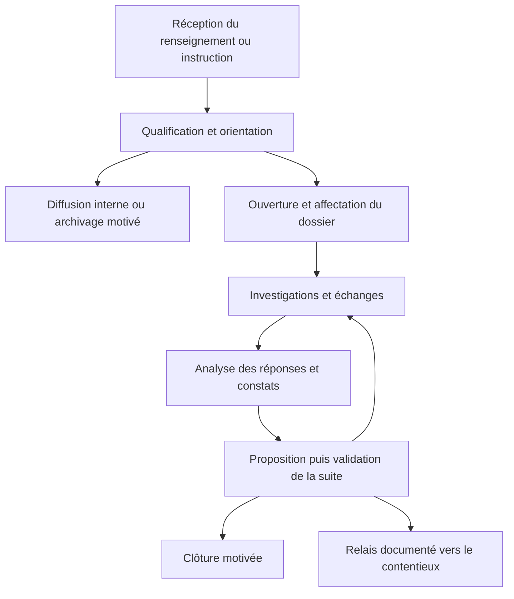
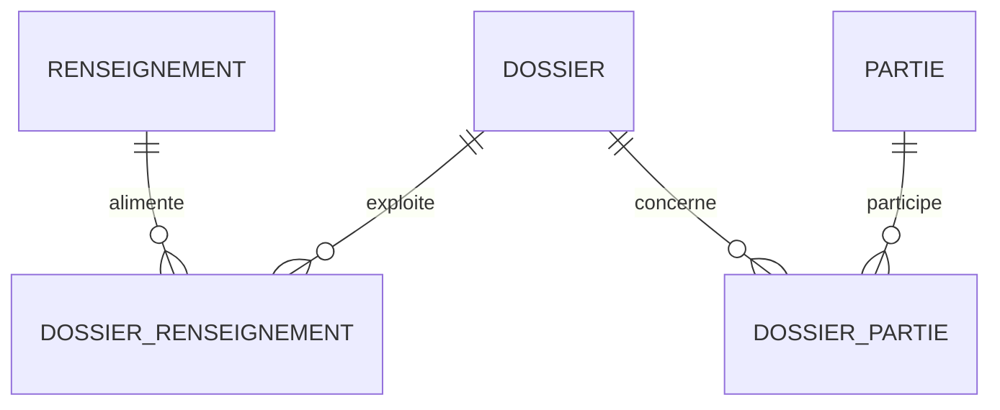
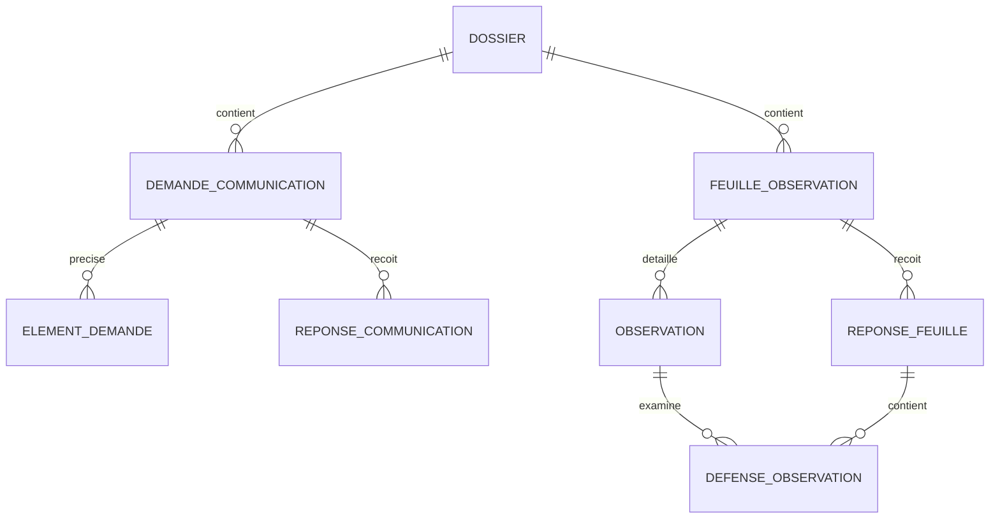

# Procezo — description du projet et base de brainstorming

> **Statut : document de travail, 24 septembre 2026.** Ce fichier rassemble le besoin exprimé, la note de cadrage `Note_de_cadrage_Procezo_DGDA(2).pdf`, les captures et les propositions discutées. Il sert à préparer les ateliers métier, les maquettes et l'architecture. Les champs, statuts, modèles, habilitations et délais proposés ici ne deviennent officiels qu'après validation par la DGDA.

## 1. Projet en une minute

Procezo est une application web interne pour les enquêteurs de la Direction générale des douanes et accises (DGDA) en République démocratique du Congo. Elle permet de recevoir et exploiter des renseignements, d'organiser des dossiers d'enquête, de préparer et suivre des demandes de communication, de rédiger des feuilles d'observation et d'analyser les réponses et éléments de défense. Elle fournit ensuite des rapports statistiques vérifiables.

Le projet était initialement centré sur les procès-verbaux (PV). À la suite du recadrage du besoin, **le coeur de Procezo se situe avant le traitement détaillé du contentieux**. GELEC couvre déjà ce dernier. Procezo doit conserver la trace d'une éventuelle transmission et les références utiles, sans reproduire le calcul ou le recouvrement des droits, taxes et amendes.

### Quatre besoins prioritaires du client

1. **Renseignement** : enregistrer, qualifier, exploiter et suivre une information ou une alerte.
2. **Demande de communication** : préparer le courrier, identifier le bon destinataire, demander des éléments précis, suivre l'envoi, les réponses et les relances.
3. **Feuille d'observation** : formaliser les constats, recevoir les éléments de défense et examiner chaque observation.
4. **Rapports statistiques** : connaître les volumes, délais, résultats et effets produits par les renseignements, demandes et observations.

Les **dossiers d'enquête**, documents, affectations, décisions et journaux d'activité sont le socle commun nécessaire à ces quatre besoins. La **gestion documentaire complète du dossier** fait partie de la V1 : retrouver, étape par étape, les documents reçus et produits, préparer rapidement les actes à partir des données saisies, obtenir leur PDF imprimable et conserver les versions réellement transmises. La V1 doit inclure les quatre besoins, même si la note antérieure classait les feuilles et les tableaux de bord en priorité P2.

### Ce qui est établi et ce qui reste proposé

| Sujet | Position de travail |
| --- | --- |
| Périmètre d'enquête et relais vers GELEC | Présenté dans la note de cadrage ; la frontière exacte autour des différents PV reste à valider. |
| Quatre besoins prioritaires | Exprimés dans les captures du client et rappelés explicitement par l'équipe. |
| Parcours, pages et modèle de données ci-dessous | Proposition de conception, à tester avec des enquêteurs et responsables. |
| Modèles de demande et de feuille | Aucun formulaire officiel complet n'a été fourni. Les premiers modèles seront des prototypes à valider. |
| Délais, signataires, règles de notification et accès à GELEC/SYDONIA | À confirmer par les responsables habilités de la DGDA. Aucune intégration technique n'est supposée disponible. |

## 2. Principes fonctionnels

### Les objets à distinguer

- **Renseignement** : information reçue d'un service de douane, d'un rapport de service, d'un aviseur, de l'opinion ou d'un autre canal autorisé. Il peut être incomplet, confidentiel et sans entreprise encore identifiée.
- **Dossier d'enquête** : affaire suivie avec un objet, un responsable, des parties concernées, une chronologie et une suite. Il peut réunir plusieurs renseignements.
- **Demande de communication** : acte de demande adressé à une personne ou organisation, avec une liste d'éléments attendus et des réponses successives.
- **Feuille d'observation** : document regroupant un ou plusieurs constats individualisés ; chaque constat peut recevoir une défense et une appréciation.
- **Document** : fichier reçu, produit ou signé, avec sa version, son auteur, sa provenance et son accès contrôlé.
- **Décision** : suite motivée proposée ou validée pour le dossier, notamment complément d'enquête, classement ou transmission.

**Cardinalités importantes :** un renseignement peut alimenter plusieurs dossiers ; un dossier peut agréger plusieurs renseignements. Un dossier peut comporter plusieurs demandes et plusieurs feuilles. Une demande peut recevoir plusieurs réponses. Une feuille peut contenir plusieurs observations ; une réponse de l'intéressé peut traiter plusieurs observations. Un dossier peut être ouvert sans renseignement initial lorsqu'une instruction ou un constat le justifie.

Une alerte diffusée à plusieurs bureaux ne crée pas automatiquement une enquête contre une entreprise. La diffusion et le retour de chaque destinataire doivent rester traçables.

### Parcours métier proposé

Ce dessin décrit une vue globale. Il **n'impose pas** que chaque dossier ait une mission, une demande et une feuille, ni que les actions soient toujours menées dans le même ordre. Une réponse absente ou partielle ne prouve pas à elle seule une infraction. L'enquêteur consigne les faits et propose la suite ; l'autorité compétente valide selon des règles à préciser.

## 3. Personae et droits

L'interface est la même application, avec menus et opérations adaptés à la fonction. Le découpage exact des habilitations doit être validé par unité et par niveau hiérarchique.

| Persona | Objectif quotidien | Pages et opérations utiles | Limites proposées |
| --- | --- | --- | --- |
| **Enquêteur DGDA** | Exploiter les renseignements affectés, instruire les dossiers et suivre les réponses. | Saisie, recherche, préparation des demandes et feuilles, analyse des réponses, proposition de suite. | Ne signe ni ne valide automatiquement un acte simplement parce qu'il en est l'auteur. |
| **Responsable d'unité / administrateur métier** | Répartir le travail, valider les actes et superviser l'activité de son périmètre. | Boîte de réception, affectations, documents à valider, décisions, statistiques d'unité. | Son accès aux renseignements confidentiels et ses pouvoirs de signature restent explicites. |
| **Administrateur technique** | Tenir le service disponible et administrer les comptes. | Utilisateurs, rôles, unités, paramètres, sauvegardes et journal technique. | L'administration technique ne donne pas de droit métier implicite de modifier ou clôturer les affaires. |
| **Lecteur/pilotage, si demandé** | Voir les résultats consolidés. | Tableaux de bord et rapports autorisés. | Les dossiers détaillés et les sources protégées restent soumis à une habilitation propre. |

Les entreprises, commissionnaires, ONG, aviseurs et autres tiers sont des **parties ou sources des dossiers**, pas des utilisateurs du site dans la V1. Un portail externe de réponse ne fait pas partie du périmètre actuel.

### Matrice simplifiée à tester

| Action | Enquêteur | Responsable métier | Admin technique |
| --- | --- | --- | --- |
| Lire un dossier affecté ou autorisé | Oui | Selon son périmètre | Non par défaut |
| Enregistrer un renseignement / un brouillon | Oui | Oui | Non |
| Affecter ou réaffecter un dossier | Selon délégation | Oui | Non |
| Préparer une demande ou une feuille | Oui | Oui | Non |
| Valider/autoriser l'émission | Selon habilitation expresse | Selon habilitation expresse | Non |
| Proposer une suite | Oui | Oui | Non |
| Valider un classement ou un transfert | Non par défaut | Selon habilitation expresse | Non |
| Gérer utilisateurs et unités | Non | Lecture éventuelle | Oui |
| Exporter des données sensibles | Droit spécifique | Droit spécifique | Non par défaut |

## 4. Arborescence et pages du site

### Navigation principale

`Mon travail` · `Renseignements` · `Dossiers` · `Demandes` · `Feuilles d'observation` · `Statistiques`

Selon les droits, des entrées supplémentaires apparaissent : `À valider` et `Administration`. L'onglet `Documents` du dossier est obligatoire en V1 ; une recherche documentaire globale peut être ajoutée si les utilisateurs en ont besoin.

### Espace enquêteur

| Page | Contenu visible | Actions |
| --- | --- | --- |
| **Mon travail** | Dossiers affectés, tâches du jour, échéances, demandes sans réponse, défenses à examiner et retours du responsable. | Reprendre une action ; filtrer « aujourd'hui », « en retard » et « à analyser ». |
| **Liste des renseignements** | Référence, objet, date, origine ou catégorie de source, niveau de confidentialité, priorité, statut et responsable. | Rechercher, filtrer, enregistrer un nouveau renseignement. |
| **Créer / modifier un renseignement** | Objet, résumé, origine, date de réception, éventuels lieux/parties/opérations, documents, confidentialité. | Sauvegarder un brouillon, soumettre, proposer une diffusion ou une enquête. |
| **Détail d'un renseignement** | Faits rapportés, pièces, historique, diffusions et retours, dossiers associés, suite obtenue. | Compléter et proposer une orientation selon les droits. |
| **Liste des dossiers** | Objet, parties, unité, enquêteur, statut, dernière action, échéance. | Rechercher une affaire et l'ouvrir. |
| **Détail d'un dossier** | Bandeau « objet, statut, responsable, prochaine action » ; onglets **Vue d'ensemble, Chronologie, Demandes, Observations, Documents, Décision**. | Ajouter une demande, une feuille, une tâche, une pièce, un compte rendu ou une proposition de suite. |
| **Documents du dossier** | Tous les documents reçus et produits, regroupés par étape et ordonnés dans la chronologie : origine, type, date, auteur, état, version, lien avec l'acte et preuve d'envoi/réception. | Ouvrir ou télécharger un document autorisé, imprimer son PDF, sélectionner plusieurs pièces ou produire un dossier PDF de consultation avec sommaire et documents imprimables. |
| **Liste des demandes** | Brouillons, demandes en validation, émises, en attente, partiellement répondues, terminées. | Rechercher, suivre, relancer selon les règles métier. |
| **Créer / détail d'une demande** | Destinataire, qualité dans l'opération, objet, période, liste numérotée des éléments demandés, courrier et preuve d'envoi, échéance, réponses. | Préparer le projet, envoyer au circuit de validation, numériser ou importer le courrier de réponse et ses pièces, puis enregistrer l'analyse par élément demandé. |
| **Liste des feuilles** | Brouillons, en validation, notifiées, en attente de défense, analysées. | Rechercher et suivre une feuille. |
| **Créer / détail d'une feuille** | Destinataire, origine du constat, observations numérotées, faits, pièces, questions, notification, éléments de défense. | Rédiger, soumettre, numériser ou importer le courrier de défense et ses pièces, puis apprécier chaque observation. |
| **Mes statistiques** | Activité personnelle sur la période et le périmètre autorisés. | Filtrer et exporter si habilité. |

Les formulaires préremplissent les données déjà présentes dans le dossier. Une sauvegarde en brouillon tolère les informations encore inconnues ; les contrôles de champs obligatoires interviennent au moment pertinent, par exemple avant l'émission du courrier ou la validation d'une décision. Pour une demande de communication, une feuille d'observation et tout autre acte papier dont le modèle a été approuvé, l'agent remplit un formulaire court, vérifie l'aperçu, puis télécharge ou imprime le PDF généré selon ses droits et l'étape de validation. Une nouvelle saisie des mêmes informations dans un traitement de texte ne doit pas être nécessaire.

### Espace responsable / administration métier

| Page | Contenu visible | Actions |
| --- | --- | --- |
| **Vue d'ensemble** | Renseignements reçus, dossiers à affecter, actes à valider, retards, indicateurs. | Ouvrir la liste correspondant à chaque chiffre. |
| **Boîte de réception** | Renseignements non qualifiés, source et confidentialité, urgence motivée. | Qualifier, réorienter, affecter, demander un complément ou autoriser une diffusion. |
| **Affectation et supervision** | Dossiers par unité, responsable, statut et échéance. | Affecter, réaffecter avec motif, suivre les dossiers bloqués. |
| **À valider** | Projets de demandes, feuilles, courriers de clôture et autres actes soumis, affichés avec le contexte du dossier. | Valider, retourner avec commentaire ou faire intervenir le signataire habilité. |
| **Décisions** | Propositions de suite, résumé des faits, réponses et pièces. | Demander un complément, valider un classement motivé ou organiser la transmission prévue. |
| **Rapports statistiques** | Vue par période, source, unité, enquêteur et issue, dans les limites de ses droits. | Filtrer, vérifier les enregistrements sous-jacents, exporter. |
| **Modèles et référentiels** | Versions des modèles, catégories de sources, types de parties, motifs et statuts. | Publier un modèle validé ; retirer une ancienne version sans modifier les documents déjà émis. |
| **Journal d'activité** | Affectations, consultations sensibles, validations, corrections et exports. | Contrôler la traçabilité. |

L'**administrateur technique** dispose en plus d'écrans distincts pour les comptes, rôles, unités, paramètres et disponibilité. Les droits métier ne découlent pas automatiquement de ce profil.

## 5. Formulaires et règles de saisie

### Renseignement

Informations minimales à la création : objet, résumé, catégorie de provenance, date de réception, agent rédacteur, degré d'accès. Informations à compléter si connues : identité protégée de la source, organisation ou personne visée, lieux, période, opérations douanières, pièces, priorité et motif de la priorité. L'identité d'un aviseur, si elle est collectée, demande un accès beaucoup plus restreint que le résumé exploitable.

Actions possibles à la qualification : **demander un complément**, **diffuser vers un ou plusieurs services**, **ouvrir ou rattacher un dossier**, **archiver avec motif**. Chaque diffusion a un destinataire, une date, un canal, une action demandée et un éventuel retour.

### Demande de communication

Champs : dossier, auteur/rédacteur, signataire habilité, destinataire, nature de la partie, rôle dans les opérations, éventuelle personne pour le compte de laquelle elle agit, objet, périmètre et période, références d'opérations si connues, **liste distincte des éléments attendus**, date et mode d'envoi, preuve d'envoi, échéance si applicable.

Chaque réponse conserve : date de réception, auteur, référence du courrier, fichier numérisé ou importé du courrier papier et pièces jointes, réponse par élément demandé, appréciation motivée, prochaine action. Plusieurs fichiers et plusieurs réponses ou compléments peuvent être rattachés à la même demande sans écraser les précédents. Les états « absence de réponse », « réponse partielle », « réponse complète » et « informations insuffisantes » ne doivent pas être confondus. Une réponse complète sur la forme peut demeurer insuffisante sur le fond.

### Feuille d'observation

Champs : dossier, rédacteur, signataire, destinataire/adresse, date, contexte et **origine du constat** (mission, renseignement, données d'un système, etc.), observations numérotées, faits précis, opérations/périodes concernées et pièces soutenant chaque observation. Une mission de contrôle peut être rattachée, sans être obligatoire lorsque la DGDA autorise une autre origine.

À la réception des éléments de défense : date de réception, courrier papier numérisé ou fichier importé, pièces, **réponse par observation**, appréciation motivée « expliqué / complément requis / observation maintenue » ou liste validée par le métier. Plusieurs fichiers et compléments peuvent être conservés sans remplacer le premier courrier ; une défense peut répondre à plusieurs observations et une observation peut recevoir un complément ultérieur.

Ne pas réunir dans un même champ la **source du renseignement** (ex. aviseur), l'**action réalisée** (ex. mission) et le **support du constat** (ex. donnée SYDONIA) : ils décrivent trois dimensions distinctes.

### Parties et opérations

Une fiche `partie` représente une personne ou une organisation. La **nature** (personne morale, personne physique ; organisation commerciale, ONG, etc.) se distingue du **rôle dans un dossier** (commissionnaire, importateur, déclarant, destinataire, détenteur des pièces, etc.). On doit pouvoir indiquer « A agit pour le compte de B » et préciser l'opération concernée. Les identifiants inconnus, tels que RCCM ou NIF, ne bloquent pas l'ouverture du dossier.

Si une opération douanière est identifiée, le dossier peut enregistrer sa référence, le bureau, sa date, son régime et la marchandise concernée. Il s'agit d'un index de recherche et de contexte, pas d'une copie de toutes les données de SYDONIA.

### Documents et modèles

- **Dossier documentaire exhaustif** : rattacher les renseignements et leurs pièces, demandes, réponses, relances, missions éventuelles, feuilles, défenses, décisions, courriers, bordereaux, justificatifs et preuves aux étapes et actes correspondants. Afficher les documents reçus et produits dans l'ordre des événements, avec filtres par étape, type et date ; une pièce ajoutée plus tard ne doit pas masquer sa date réelle de réception.
- **Saisie rapide et génération** : utiliser un formulaire web prérempli depuis le dossier pour chaque acte à émettre, notamment demande de communication et feuille d'observation ; permettre l'aperçu, la correction du brouillon, puis la génération d'un PDF mis en page à partir d'un modèle approuvé. Le PDF doit être directement téléchargeable et imprimable pour la remise ou l'envoi papier. Le DOCX sert à préparer et faire évoluer les modèles pendant le cadrage, pas à ressaisir chaque acte.
- **Impression du dossier** : permettre à l'utilisateur habilité d'imprimer un document isolé ou de produire un PDF de consultation du dossier, ordonné par étapes, avec sommaire, références et documents imprimables. Les fichiers qui ne peuvent pas être intégrés au PDF restent téléchargeables avec leur référence dans le sommaire. Les documents confidentiels n'entrent dans cet ensemble que selon les droits de l'utilisateur ; téléchargement et export sont journalisés.
- **Circuit papier traçable** : distinguer PDF brouillon, acte validé dans l'application, version imprimée/signée, version effectivement remise ou envoyée, et preuve de remise ou d'envoi. Si la signature est physique, conserver le scan de l'original signé et la preuve de notification ou d'envoi. L'impression seule ne vaut ni signature ni notification.
- **Réception papier** : permettre de joindre un scan ou un fichier importé (PDF ou image lisible) du courrier retourné et de chaque pièce, depuis la demande, la feuille ou le dossier. Enregistrer la date réelle de réception, l'expéditeur, le type de réponse et l'agent qui l'a ajoutée ; lier la réponse à l'acte concerné et la faire apparaître à la bonne étape de la chronologie et dans `Documents`. Permettre plusieurs fichiers et des compléments ultérieurs. La saisie structurée de l'analyse complète les fichiers reçus sans les remplacer ; une correction conserve la trace de la version précédente.
- **Conservation** : conserver le modèle et sa version, l'auteur, le signataire, les pièces jointes, l'historique de validation et les versions produites. Une nouvelle génération ne doit jamais écraser le document effectivement envoyé. « Validé dans l'application » et « signé officiellement » restent deux informations séparées tant que leur équivalence n'est pas établie.

## 6. Statuts et indicateurs

Les libellés exacts seront validés avec la DGDA. Proposition initiale :

| Objet | Statuts de travail proposés |
| --- | --- |
| Renseignement | Brouillon → À qualifier → Orienté / Diffusé / Lié à un dossier / Archivé avec motif. |
| Dossier | À affecter → En cours → En attente → À valider → Clôturé. L'**issue** est un champ distinct du statut. |
| Demande | Brouillon → À valider → Émise → En attente ou réponse partielle → Terminée. |
| Feuille | Brouillon → À valider → Notifiée → Défense reçue → Analysée. |
| Décision | Proposée → Validée ou retournée pour complément. |
| Transfert contentieux | Préparé → Transmis → Réception confirmée. |

**« En retard » est un indicateur calculé sur une échéance applicable**, pas un statut qui efface « en cours » ou « en attente ». Plusieurs demandes ou tâches d'un même dossier peuvent avancer simultanément.

### Indicateurs prioritaires

| Rubrique | Indicateurs | Précaution de calcul |
| --- | --- | --- |
| Renseignement | Reçus par source/période, qualifiés, diffusés, ayant entraîné une enquête, effets obtenus. | Un renseignement lié à deux dossiers reste un seul renseignement reçu. |
| Demandes | Émises, sans réponse, réponses partielles/complètes, délais de première réponse et de complétude. | Calculer avec les dates d'émission/réception effectivement enregistrées. |
| Feuilles | Créées, émises/notifiées, défenses reçues, observations expliquées/maintenues. | Distinguer nombre de feuilles et nombre d'observations. |
| Dossiers | Affectés, en cours, en retard, clôturés, classements motivés, relais au contentieux. | Distinguer nombre de dossiers et nombre de demandes, feuilles ou PV. |

Chaque valeur du tableau de bord ouvre la liste filtrée des dossiers ou actes qui la composent. Les rapports sont produits par requête sur les événements et les tables métier. **Ne pas stocker un total manuel dans une table `statistiques`**. Journaliser les exports autorisés.

## 7. Schéma conceptuel de base de données

Ce schéma est volontairement global. `id` désigne la clé primaire (PK), `*_id` une clé étrangère (FK). Les dates de création/mise à jour, la provenance, le créateur et les index de recherche s'ajoutent selon les besoins. Les types exacts et contraintes SQL restent à détailler avec les développeurs.

### Comptes, unités et autorisations

| Table | Champs principaux et sens |
| --- | --- |
| `unite` | `id`, `nom`, `type`, `unite_parent_id?` : services ou bureaux habilités. |
| `utilisateur` | `id`, `nom`, `matricule?`, `email/login`, `unite_id`, `actif`. |
| `role` | `id`, `code`, `libelle` : enquêteur, responsable métier, admin technique, etc. |
| `utilisateur_role` | `utilisateur_id`, `role_id` : plusieurs fonctions possibles ; droits réellement vérifiés côté serveur. |
| `affectation_dossier` | `id`, `dossier_id`, `utilisateur_id`, `debut`, `fin?`, `affecte_par_id`, `motif?` : historique des affectations. |

### Renseignement et dossier

| Table | Champs principaux et sens |
| --- | --- |
| `renseignement` | `id`, `reference` unique, `objet`, `resume`, `source_type`, `date_reception`, `priorite`, `confidentialite`, `statut`, `responsable_id?`. Séparer les éventuelles données d'identité de source protégées. |
| `diffusion_renseignement` | `id`, `renseignement_id`, `unite_destinataire_id`, `envoye_par_id`, `date_envoi`, `canal`, `action_attendue`, `date_retour?`, `retour?`. |
| `dossier` | `id`, `reference` unique, `objet`, `motif_ouverture`, `statut`, `issue?`, `unite_id`, `date_ouverture`, `prochaine_echeance?`, `date_cloture?`. |
| `dossier_renseignement` | `dossier_id`, `renseignement_id` ; PK composite, association plusieurs-à-plusieurs. |
| `partie` | `id`, `nom`, `nature`, `categorie`, `adresse?`, `rccm?`, `nif?`, `contacts?`. L'absence d'identifiant administratif n'empêche pas la saisie. |
| `dossier_partie` | `id`, `dossier_id`, `partie_id`, `role_dans_dossier`, `agit_pour_partie_id?` ; relation contextualisée. |
| `operation_douaniere` | `id`, `dossier_id`, `reference_declaration?`, `bureau?`, `date_operation?`, `regime?`, `description_marchandise?`. Références, sans duplication du système de dédouanement. |
| `tache` | `id`, `dossier_id`, `responsable_id`, `objet`, `echeance?`, `statut`, `terminee_le?` : prochaine action explicite. |

### Demandes de communication

| Table | Champs principaux et sens |
| --- | --- |
| `demande_communication` | `id`, `dossier_id`, `destinataire_dossier_partie_id`, `auteur_id`, `signataire_id?`, `objet`, `periode_debut?`, `periode_fin?`, `statut`, `date_emission?`, `echeance?`, `mode_envoi?`, `reference_courrier?`. |
| `element_demande` | `id`, `demande_id`, `numero`, `description`, `statut_reception` : un document ou renseignement demandé par ligne. |
| `reponse_communication` | `id`, `demande_id`, `date_reception`, `auteur`, `reference_courrier?`, `resume`, `appreciation_globale?`, `commentaire_enqueteur?`. Plusieurs réponses possibles. |
| `reponse_element` | `id`, `reponse_id`, `element_demande_id`, `etat`, `commentaire?`. Vérifier que la réponse et l'élément appartiennent à la même demande. |

### Missions, feuilles et défenses

| Table | Champs principaux et sens |
| --- | --- |
| `mission_controle` | `id`, `dossier_id`, `objet`, `lieu?`, `responsable_id`, `date_debut?`, `date_fin?`, `reference_autorisation?`, `compte_rendu?`. Une fiche simple suffit au départ. |
| `feuille_observation` | `id`, `dossier_id`, `mission_id?`, `destinataire_dossier_partie_id`, `auteur_id`, `signataire_id?`, `origine_constat`, `statut`, `date_emission?`, `date_notification?`. |
| `observation` | `id`, `feuille_id`, `numero`, `faits`, `justificatifs_decrits?`, `periode?`, `appreciation_finale?`. Numéro unique au sein d'une feuille. |
| `reponse_feuille` | `id`, `feuille_id`, `date_reception`, `auteur`, `reference_courrier?`, `resume?`. Plusieurs courriers ou compléments possibles. |
| `defense_observation` | `id`, `reponse_feuille_id`, `observation_id`, `argument`, `appreciation_enqueteur?`, `motif_appreciation?`. Vérifier que la réponse et l'observation portent sur la même feuille. |

### Décision, documents et traçabilité

| Table | Champs principaux et sens |
| --- | --- |
| `decision` | `id`, `dossier_id`, `type_decision`, `motif`, `statut_validation`, `proposee_par_id`, `validee_par_id?`, `date_validation?`. Une nouvelle décision peut documenter une réouverture ou une correction motivée. |
| `transfert_contentieux` | `id`, `dossier_id`, `decision_id`, `date_transfert?`, `destinataire?`, `reference_pv?`, `reference_gelec?`, `date_confirmation?`, `statut`. Aucun calcul de droits/amendes dans Procezo. |
| `document` | `id`, `nom`, `type_document`, `mime_type`, `emplacement_securise`, `empreinte_sha256`, `version`, `classification`, `depose_par_id`, `date_depot` ; ne pas stocker les octets du fichier dans les champs métier. |
| `modele_document` | `id`, `type_modele`, `numero_version`, `statut` (provisoire/approuvé/retiré), `date_application?`, `emplacement_modele`, `approuve_par_id?`. |
| `evenement_dossier` | `id`, `dossier_id`, `type_evenement`, `resume`, `auteur_id`, `date_evenement` : chronologie compréhensible par les agents. |
| `journal_audit` | `id`, `utilisateur_id`, `action`, `objet_type`, `objet_id`, `horodatage`, `details_autorises` : consultation, modification, validation, export ; protégé contre l'altération ordinaire. |

**Pièces jointes et relations :** rattacher chaque document aux objets concernés avec des tables de liaison explicites munies de FK (`document_renseignement`, `document_dossier`, `document_demande`, `document_reponse_communication`, `document_feuille`, `document_reponse_feuille`, etc.). La vue « Documents du dossier » réunit ensuite ces pièces par les relations métier. Éviter une relation générique `objet_type` + `objet_id` pour les pièces si l'on veut garantir l'intégrité référentielle ; le journal d'audit peut, lui, enregistrer ce couple à des fins de trace.

### Relations principales

**Règles d'intégrité à prévoir :** références métier uniques ; clés étrangères effectives ; conservation de l'historique des affectations ; pièces et actes émis non écrasés ; contrôle des transitions de statut ; dates cohérentes ; unicité des numéros d'observation dans une feuille ; impossibilité d'associer une réponse à l'élément d'une autre demande ou à une observation d'une autre feuille. Ne pas supprimer physiquement un acte validé pour « corriger » l'historique : faire une nouvelle version ou un événement de rectification suivant la règle approuvée.

## 8. Relais GELEC et frontières entre systèmes

Procezo recueille le contexte, les actions et les pièces de l'enquête. Lorsqu'une suite contentieuse est validée, il prépare un bordereau ou dossier de transmission, enregistre la date, le destinataire, les références du PV et de GELEC lorsqu'elles sont disponibles, puis la confirmation de réception. Séparer `préparé`, `transmis` et `reçu`.

La frontière exacte doit être décidée avec la DGDA : où sont rédigés et enregistrés le **PV d'infraction**, les éventuels **PV d'opérations/constats** et les autres documents ? Tous les actes appelés « PV » n'ont pas nécessairement la même fonction. Aucun accès à une API GELEC ou SYDONIA n'est présumé ; une référence et un transfert manuel tracé constituent une première étape exploitable.

## 9. Qualité d'usage et exigences transversales

- Recherche par référence, entreprise/personne, bureau, date, statut et responsable, dans la limite des droits.
- Écrans clairs et rapides : un objectif principal par écran ; indication permanente de la prochaine action.
- Brouillons et préremplissage ; champs obligatoires uniquement au moment nécessaire.
- Accès contrôlé selon rôle, unité, affectation et niveau de confidentialité ; sources protégées isolées des exports ordinaires.
- Historique des créations, changements d'affectation, validations, consultations sensibles, documents et exports.
- Sauvegardes et restauration testée ; capacité et performance adaptées au nombre réel d'utilisateurs et aux contraintes réseau des sites.
- Versions des modèles et conservation des documents effectivement émis.
- Les conditions d'hébergement, conservation, signature, notification et éventuel usage hors connexion seront précisées avec la DGDA.

## 10. Première version et scénarios de recette

### V1 utilisable

1. Authentification, unités, rôles et accès par dossier.
2. Réception, qualification et diffusion du renseignement ; création et affectation du dossier.
3. Demandes de communication, liste des éléments demandés, réponses papier numérisées ou importées, réponses partielles, pièces et relances.
4. Feuilles avec observations numérotées, courriers de défense numérisés ou importés, pièces et appréciation par observation.
5. Validation des actes et décisions, clôture motivée, références du relais contentieux.
6. Documents du dossier complets et ordonnés par étape ; formulaires préremplis, aperçu et PDF imprimable des demandes et feuilles sur modèles approuvés ; impression d'un document ou d'un dossier PDF de consultation, conservation des versions émises, du scan signé et des preuves papier ; statistiques vérifiables sur les quatre besoins.
7. Fiche de mission simple si le processus de contrôle utilisé dans le pilote le requiert.

Des échanges automatisés GELEC/SYDONIA, des analyses avancées, un portail externe et des automatisations complexes pourront être cadrés après validation du processus et des accès.

### Trois démonstrations métier à préparer

1. **Réponse satisfaisante** : renseignement → dossier → demande de communication → réponse et justificatifs → analyse → classement motivé → effet visible dans les statistiques.
2. **Réponses partielles et observations multiples** : dossier → demande et compléments → mission éventuelle → feuille de plusieurs observations → défense couvrant certaines observations → suite validée → relais tracé au contentieux.
3. **Alerte interservices** : renseignement sans entreprise identifiée → diffusion à plusieurs bureaux → accusés/retours → enquête éventuelle, sans création artificielle d'une cible.

Pour chaque démonstration, vérifier aussi que les documents reçus et produits apparaissent à la bonne étape du dossier ; qu'un agent peut saisir un acte une fois, prévisualiser et imprimer son PDF ; qu'il peut numériser ou importer une réponse papier et ses annexes, puis les rattacher à la demande ou à la feuille concernée ; et que les versions signées/transmises, les réponses successives et leurs preuves restent consultables sans être remplacées par un nouveau brouillon ou complément.

## 11. Questions précises pour l'atelier DGDA

1. Quels services et quels grades peuvent **rédiger, exercer, signer, valider et notifier** chaque acte ? Quels changements ont suivi la restructuration ?
2. Quels sont les exemples anonymisés des documents réellement utilisés : demandes, feuilles, réponses, ordre de mission, rapport, classement, PV, bordereau de transmission ? Quelles mentions et signatures sont obligatoires ?
3. Une demande ou une feuille peut-elle être créée **sans dossier préalablement ouvert** ? Une feuille peut-elle être issue de chaque origine de constat envisagée ?
4. Quelles sont les étapes officielles, les cas d'urgence, les délais applicables, la preuve de notification, les relances et les règles de prorogation ?
5. Quelles catégories de sources et quelles règles de confidentialité s'appliquent, en particulier pour l'identité d'un aviseur et les informations commerciales sensibles ?
6. Qui décide du classement, d'une nouvelle enquête ou du transfert au contentieux ? À quel stade et dans quel outil chaque type de PV est-il établi ?
7. Quelles informations minimales GELEC doit-il recevoir et comment vérifier la bonne réception ? Existe-t-il un échange autorisé avec SYDONIA ou GELEC ?
8. Quels indicateurs sont effectivement utilisés par la hiérarchie, avec quelle définition des « effets du renseignement » et des délais ?
9. Quels bureaux utiliseront le pilote, avec quels réseaux, équipements, volumes de dossiers et règles d'hébergement et de conservation ?

## 12. Repères documentaires

- Note interne fournie : `Note_de_cadrage_Procezo_DGDA(2).pdf` (Young Solver, 18 septembre 2026), six pages. Les processus et responsabilités qui y figurent sont expressément soumis à la validation de la DGDA.
- Captures fournies dans la conversation : demande de communication, feuille d'observation, renseignement, rapports statistiques, ainsi qu'un premier tableau de modules.
- Référence publique utile au cadrage des contrôles : [Décision DG/DGDA/DG/2011/296 du 11 août 2011 sur les mesures d'application du Code des douanes](https://douane.gouv.cd/wp-content/uploads/2022/04/DG-DGDA-DG-2011-296-11.08.2011.pdf), notamment ses articles 42 à 52 sur les contrôles a posteriori. Vérifier les textes consolidés et instructions internes applicables avant de transformer une règle en validation automatique.
- [Présentation DGDA de la lutte contre la fraude et du renseignement](https://douane.gouv.cd/dgda/services/direction-de-la-lutte-contre-la-fraude/) et [présentation de SYDONIA](https://douane.gouv.cd/dgda/outils-informatiques/sydonia/). Elles contextualisent les systèmes ; elles ne décrivent pas à elles seules le workflow interne du service demandeur.

---

**Instruction pour le brainstorming dans Codex :** partir de ce document comme hypothèse structurée ; distinguer chaque fois besoin confirmé, décision de conception et règle DGDA à valider. Concevoir d'abord le parcours complet des trois scénarios de recette, puis détailler les maquettes, permissions, contraintes SQL/API et critères d'acceptation sans inventer de formulaire, de délai légal, de pouvoir de signature ou d'intégration existante.
